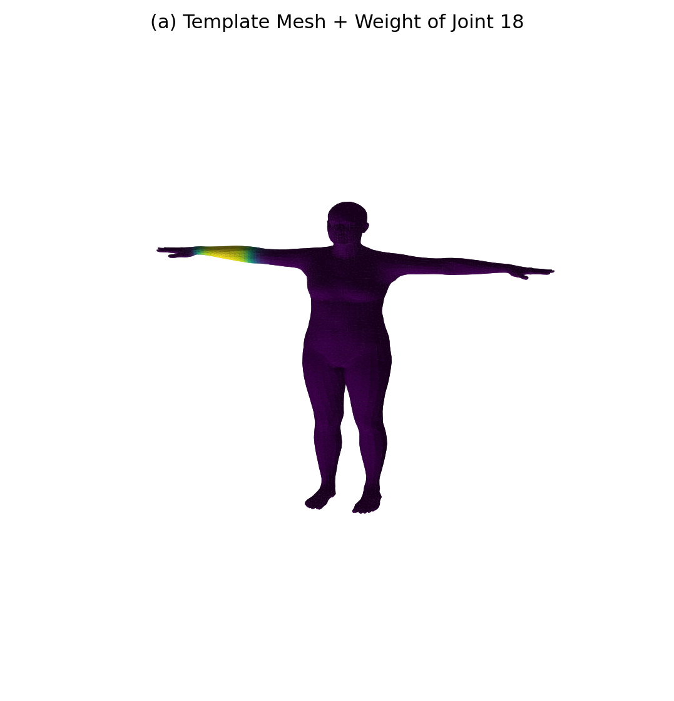
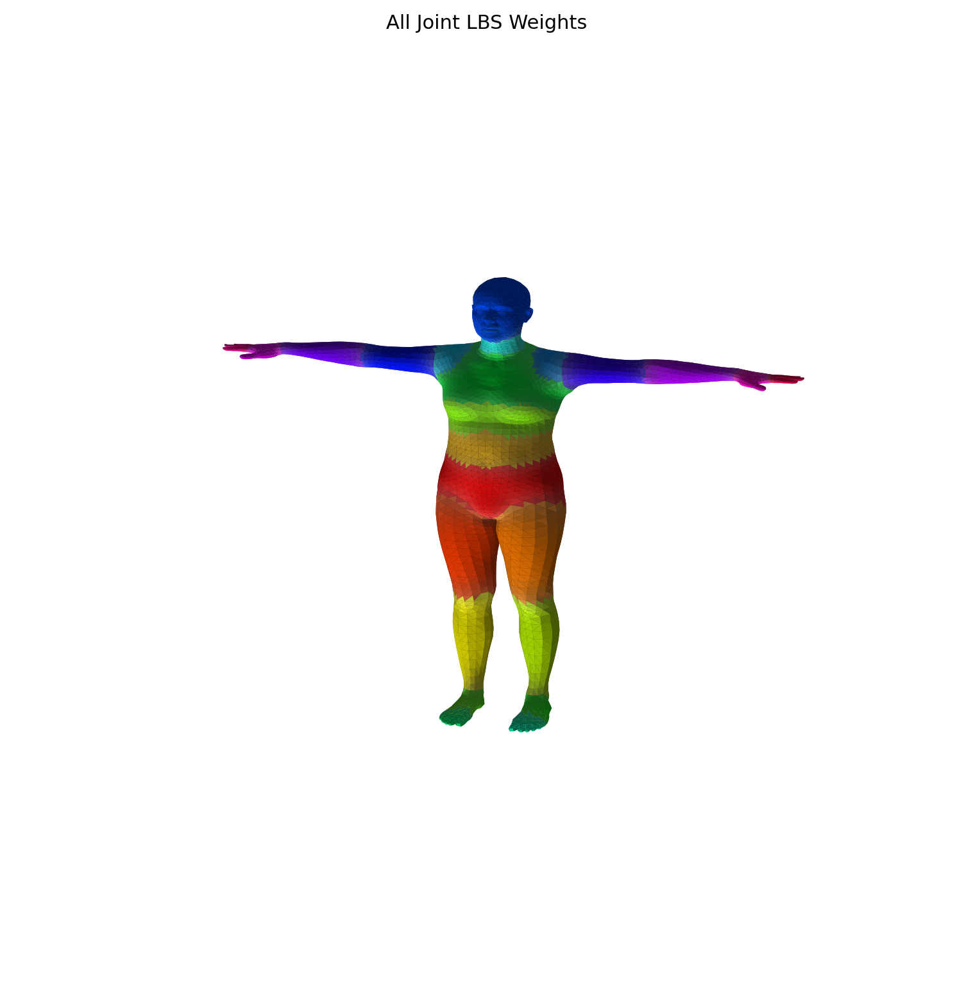
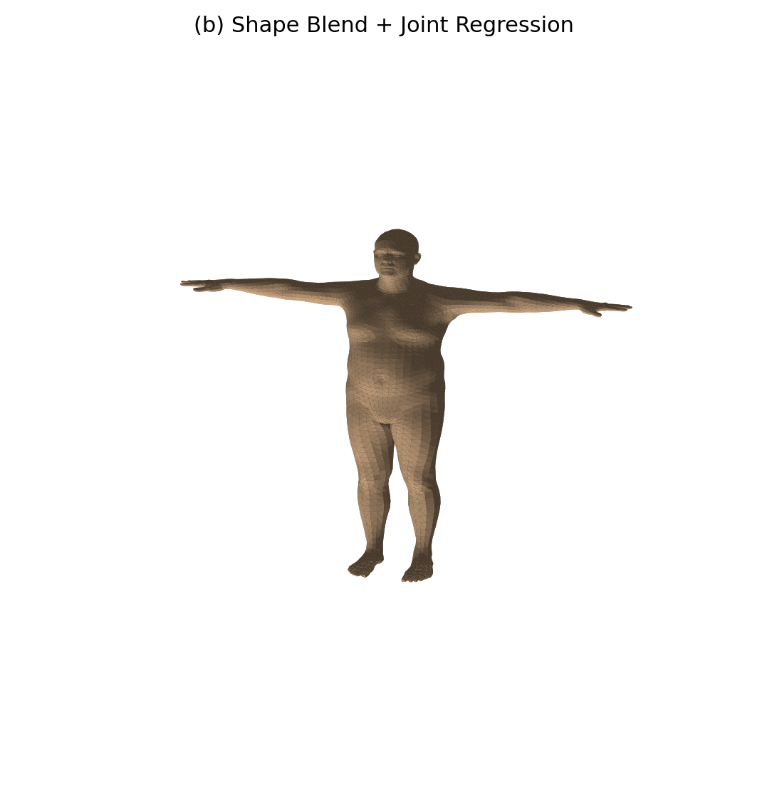
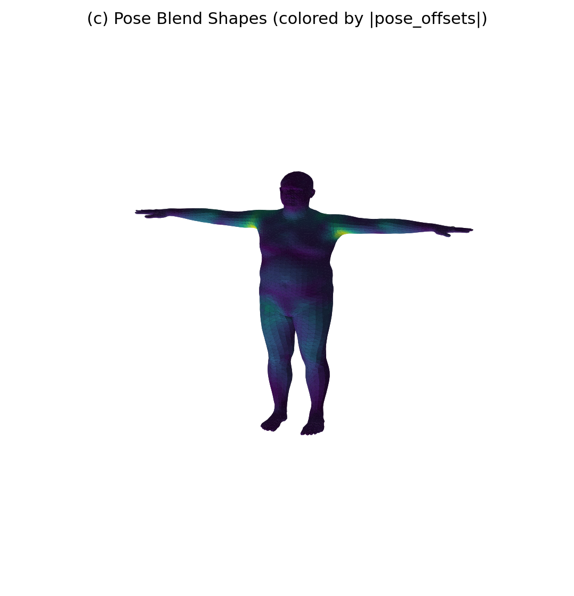
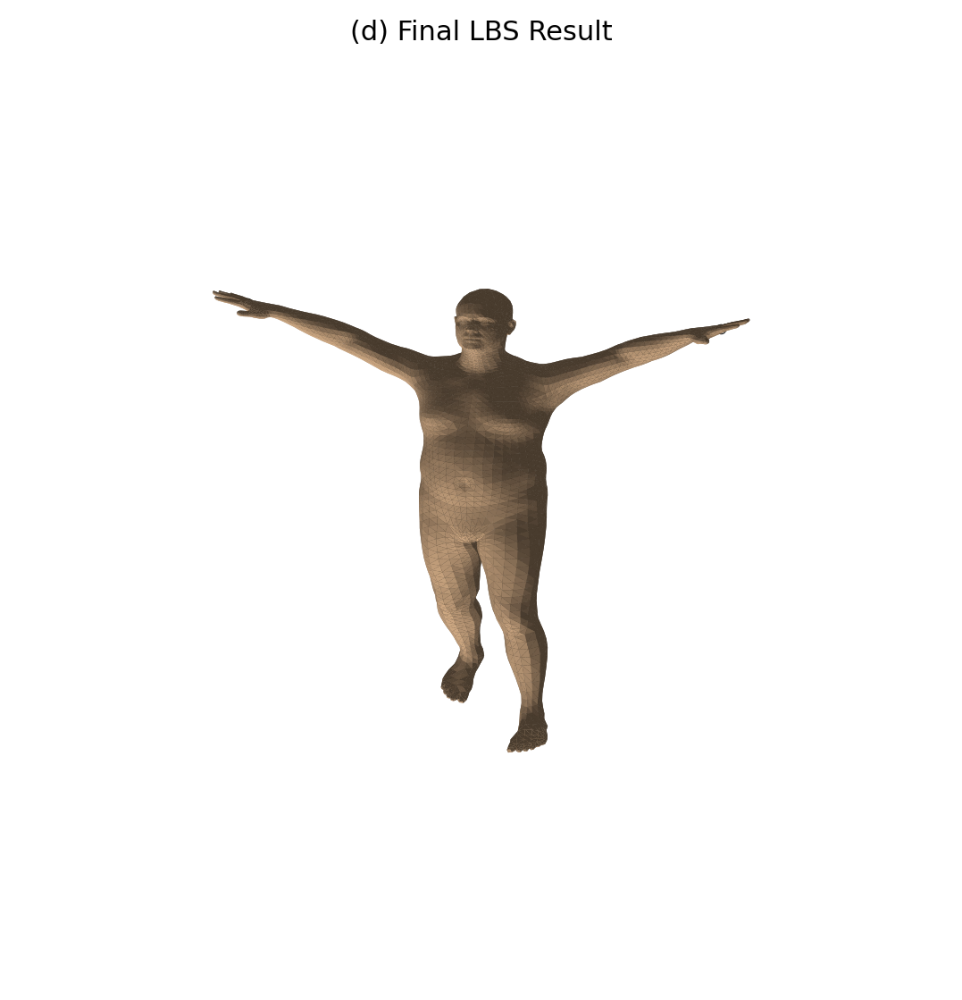
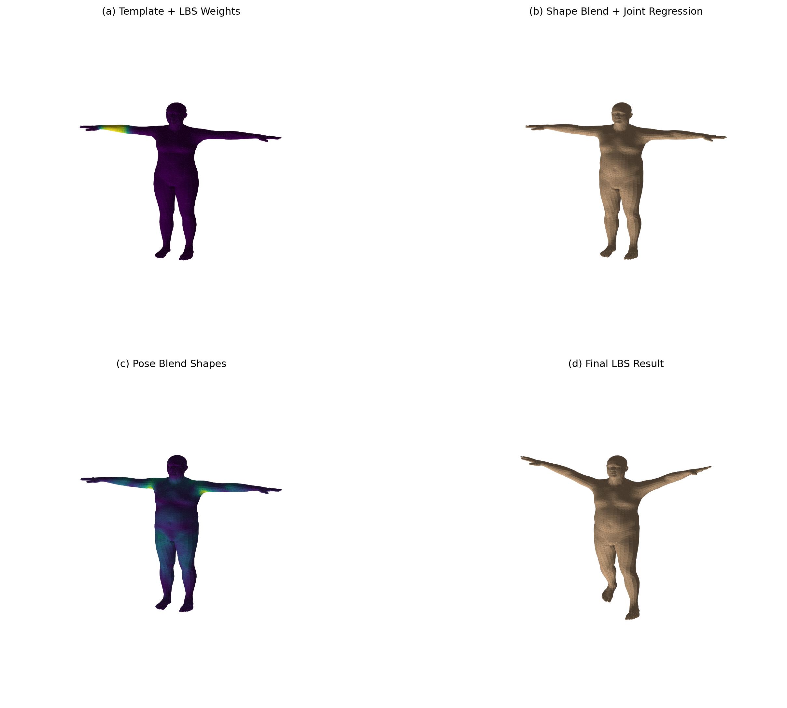
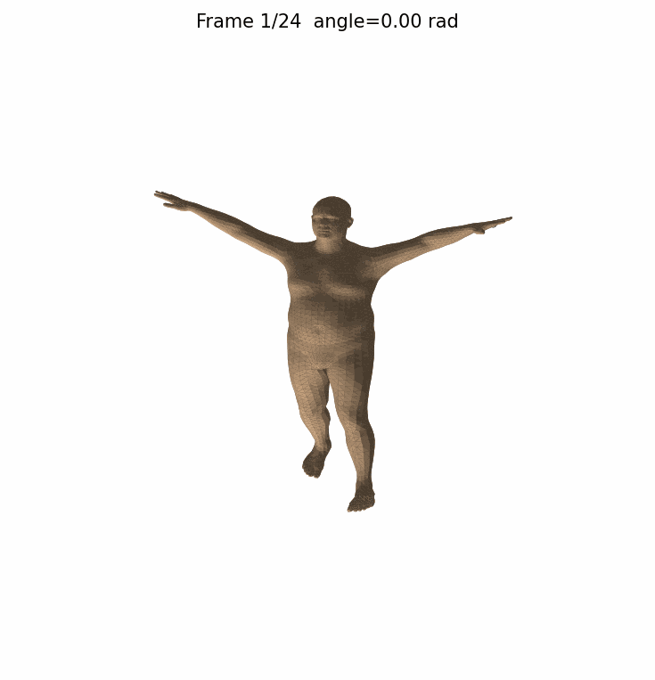

# SMPL LBS 蒙皮可视化实验

本实验基于 SMPL 人体参数化模型，完整实现并可视化 **线性混合蒙皮（Linear Blend Skinning, LBS）** 的四个核心阶段。项目代码复现 SMPL 前向过程中的关键中间量，并与官方实现进行误差对比，同时提供选做的姿态动画生成。

---

## 实验目标

1. 理解参数化人体模型中模板网格、形状参数、姿态参数、关节回归器和蒙皮权重之间的关系。
2. 掌握 LBS 的四个阶段：
   - (a) 模板网格 $\bar{T}$ 与蒙皮权重 $\mathcal{W}$
   - (b) 形状校正 $B_S(\beta)$ 与关节回归 $J(\beta)$
   - (c) 姿态校正 $B_P(\theta)$
   - (d) 线性混合蒙皮得到最终顶点
3. 学会手动调用 SMPL 底层函数，提取并可视化关键中间量。
4. 验证手写 LBS 与官方模型前向的一致性。
5. （选做）生成单一关节旋转动画，观察蒙皮效果。

---

## 实验原理简介

SMPL 模型的 LBS 过程分为四个步骤：

1. **模板网格与蒙皮权重**  
   初始 T-pose 网格 $\bar{T}$，每个顶点预定义了对 $K$ 个关节的影响权重 $\mathcal{W}$。

2. **形状混合 (Shape Blend)**  
   根据形状参数 $\beta$ 对模板网格进行线性形变：  
   $T_{shape} = \bar{T} + B_S(\beta)$  
   再由变形后的网格回归出关节位置：  
   $J(\beta) = \mathcal{J}(T_{shape})$

3. **姿态混合 (Pose Blend)**  
   根据姿态参数 $\theta$ 计算旋转矩阵，提取姿态特征 $R - I$，通过线性回归得到姿态偏移：  
   $T_P(\beta,\theta) = \bar{T} + B_S(\beta) + B_P(\theta)$

4. **线性混合蒙皮 (LBS)**  
   对每个顶点，用其权重对各关节的全局刚体变换加权平均，得到最终变形后的顶点：  
   $v_i' = \sum_{k=1}^{K} w_{ik} \, G_k(\theta, J) \, \begin{bmatrix} v_i^{posed} \\ 1 \end{bmatrix}$

---

## 项目结构

```
lbs_lab/
├── run_lbs_lab.py                      # 主程序（包含所有实验任务与动画）
├── models/
│   └── smpl/
│       └── SMPL_NEUTRAL.pkl            # SMPL 模型文件
├── outputs/                            # 自动生成的输出目录
│   ├── stage_a_template_weights.png
│   ├── stage_b_shaped_joints.png
│   ├── stage_c_pose_offsets.png
│   ├── stage_d_lbs_result.png
│   ├── comparison_grid.png
│   ├── all_joint_weights.png           # 可选
│   ├── summary.txt
│   └── animation.gif                   # 选做
└── README.md
```

---

## 环境配置

### 1. 安装 Conda (推荐) 或 Python 虚拟环境

```bash
conda create -n cg-lbs python=3.10 -y
conda activate cg-lbs
```

### 2. 安装 PyTorch (CPU 版本即可)

```bash
pip install torch
```

### 3. 安装其余依赖

```bash
pip install numpy matplotlib smplx Pillow
```

> **注意**：生成动画需要 `Pillow` 库，基础实验可不安装。

---

## 运行方法

### 下载模型文件

将 `SMPL_NEUTRAL.pkl` 放置到 `models/smpl/` 目录下。  
模型可从 SMPL 官网 (https://smpl.is.tue.mpg.de) 获取（仅限学习用途）。

### 基本实验（任务 1~7）

```bash
python run_lbs_lab.py --model-dir ./models --out-dir ./outputs --joint-id 18
```

参数说明：
- `--model-dir`：包含 `smpl/SMPL_NEUTRAL.pkl` 的目录。
- `--out-dir`：输出图片和摘要的目录，默认为 `./outputs`。
- `--joint-id`：用于单关节权重可视化的关节编号（0~23），默认为 18（左肘）。
- `--num-betas`：使用的形状参数个数，默认为 10。

### 选做：姿态动画

```bash
python run_lbs_lab.py --model-dir ./models --out-dir ./outputs --animate
```

自定义动画关节与角度：
```bash
python run_lbs_lab.py ... --animate --animate-joint left_elbow \
    --animate-start 0.0 --animate-end -1.2 --animate-frames 30
```

动画将保存在 `outputs/animation.gif`。

---

## 输出结果

成功运行后，`outputs/` 目录下将生成以下文件：

| 文件名 | 说明 |
|--------|------|
| `stage_a_template_weights.png` | 模板网格 + 指定关节的权重热力图 |
| `all_joint_weights.png` | 各顶点的主导关节分布（可选） |
| `stage_b_shaped_joints.png` | 体型变化后的网格 + 回归的关节 |
| `stage_c_pose_offsets.png` | 姿态混合后的网格，着色表示偏移量大小 |
| `stage_d_lbs_result.png` | 最终 LBS 蒙皮结果 |
| `comparison_grid.png` | 四阶段 2×2 对比图 |
| `summary.txt` | 模型基础信息与误差数据 |
| `animation.gif` | 选做动画（仅当使用 `--animate`） |

`summary.txt` 示例内容：
```
===== SMPL LBS Lab Summary =====
num_vertices: 6890
num_faces: 13776
num_joints(from lbs_weights): 24
num_betas: 10
visualized_joint_id: 18
manual_vs_official_mean_abs_error: 0.0000000000
manual_vs_official_max_abs_error: 0.0000000000
```

---

## 实验结果展示

### 阶段 (a)：模板网格 + 蒙皮权重



### 全关节主导权重分布（可选）



### 阶段 (b)：形状校正 + 关节回归



### 阶段 (c)：姿态校正 (Pose Blend Shapes)



### 阶段 (d)：最终 LBS 蒙皮结果



### 四阶段综合对比



### 选做动画（示例）



---

## 思考题参考

**任务2 – 蒙皮权重**
1. **为何一个顶点受多个关节影响？**  
   为了使皮肤变形平滑自然。如果每个顶点只绑定一个关节，关节旋转时会形成不连续的“断裂”效果。
2. **权重几乎全给一个关节的效果？**  
   该顶点将严格跟随该关节运动，效果接近刚体绑定，弯曲处会出现尖锐折痕。
3. **权重分布很平均的效果？**  
   该顶点被多个关节均匀影响，运动时平滑但可能出现“塌陷”或“糖纸”效应。

**任务3 – 形状校正与关节回归**
1. **为何关节要从形状后的网格回归？**  
   不同体型（高矮胖瘦）的人体关节位置会变化，固定关节无法适配体态差异。
2. **体型变化对关节位置的影响？**  
   会。例如肩宽增加，肩关节外移；变胖后髋关节间距可能增大。
3. **v_template 与 v_shaped 的差别？**  
   `v_template` 是标准 T-pose 模板，`v_shaped` 是添加了形状偏移后的网格，体现个体体型特征。

**任务4 – 姿态校正**
1. **为何 LBS 前要加 pose corrective？**  
   纯骨骼旋转无法表达肌肉膨胀、皮肤褶皱等非线性形变，姿态校正能弥补这些细节。
2. **去掉 pose_offsets 的后果？**  
   肘部、膝盖等弯曲处会出现明显塌陷或不自然的几何收缩。
3. **v_shaped 与 v_posed 的本质区别？**  
   `v_shaped` 仅包含体型变形，处于 T-pose；`v_posed` 已叠加姿态引起的非线性修正，但尚未经过骨骼蒙皮。

**任务5 – 最终 LBS**
1. **J 与 J_transformed 的区别？**  
   `J` 是 T-pose 下关节位置，`J_transformed` 是经过骨骼链全局变换后的运动姿态关节位置。
2. **为何用加权和而非最大权重关节？**  
   加权和保证了顶点运动的连续性和平滑过渡，避免了接缝处的不连续性。

---

## 代码说明

- `run_lbs_lab.py` 包含完整的实验流程，所有函数均有详细注释。
- 通过 `compute_manual_lbs()` 函数手动复现 SMPL 的 LBS 过程，返回各阶段中间量。
- 使用 `compare_with_official_forward()` 与 SMPL 官方前向输出逐顶点对比，验证数值准确性。
- 绘图函数基于 Matplotlib 3D 渲染，支持面片着色、光照和关节叠加。

---